# Google Stock Market Prediction

## What is a time series and why analyse it?

Time series is a sequence of observations recorded at regular intervals of time. For example, daily stock prices, energy/ water consumption, traffic flow in major highways, retail demand etc. Time series analysis provides insights like seasonal patterns, trends and demand forecasting that can help maximize the profits.

### Get the stock price data using finance API:
Yahoo finance is one of the most popular websites to get stock data. In order to get real time data we collect the stock data using the yfinance API. 
You can install yfinance by using pip in your terminal as follows:

Pip install yfinance

The we extract last one year of data.

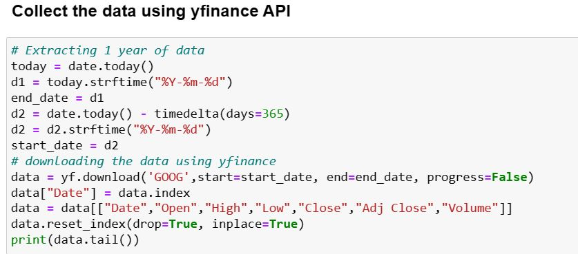

There are no null or missing values in the dataset so we move to visualisations.
We use various charts such as candlestick chart, bar chart and rangeslider to visualize the data.

### Data Visulaisation

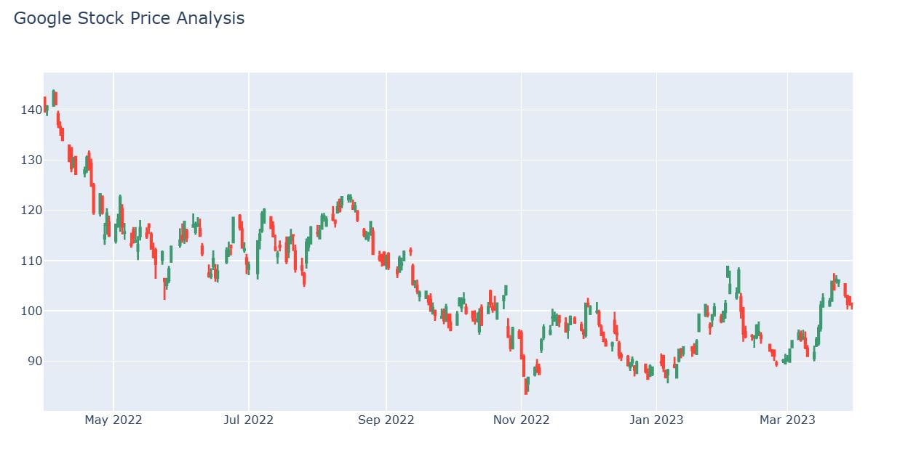

#### Insights
Each candlestick represents the stock's open, high, low, and close prices for a specific period (daily, weekly, etc.).

Green Candlesticks: Indicate that the closing price was higher than the opening price (positive growth for the period).

Red Candlesticks: Indicate that the closing price was lower than the opening price (negative growth for the period). 

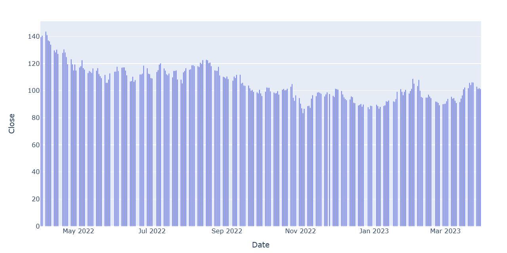

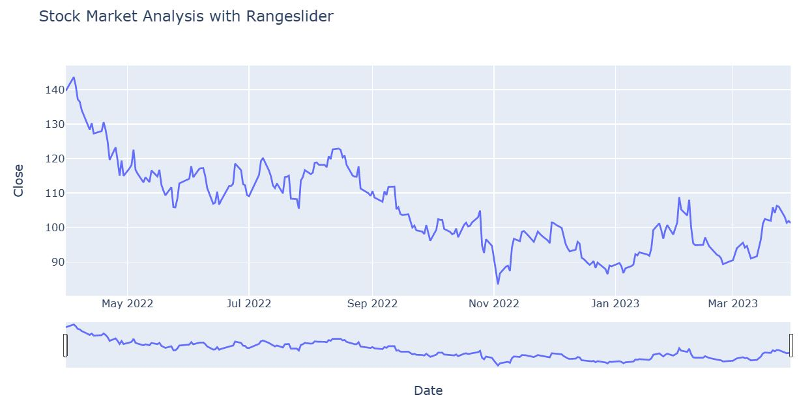

## The Concept of stationarity
This is a key concept in time-series analyses. Stationarity means the manner in which time series data changes is constant. In other words, the statistical properties like mean and variance remain constant over time. This does not mean that the value of each data point is the same, but the behaviour remains unchanged over time. There are no trends or seasonal patterns. 
Trend is when there is a long term increase or decrease in the data. For example if we consider the population of earth over the last 50 years, there would be a clear trend of increasing population. Seasonality is a recurring pattern at a fixed or known frequency. For example the sales of faux fur items would peak every winter and lower during summers and the sales of beachwear would peak during summers and fall during winters. Stationarity is an underlying assumption in many time series methods. This assumption is important because, when you take a certain behaviour over time, it is important that the behaviour remains unchanged in future in order to forecast the future series.

### Decomposing the time-series

We decompose the time-series to check for trend or seasonality.
The seasonal decomposition method splits the time series data into trend, seasonality and residuals for better understanding of the time-series data.

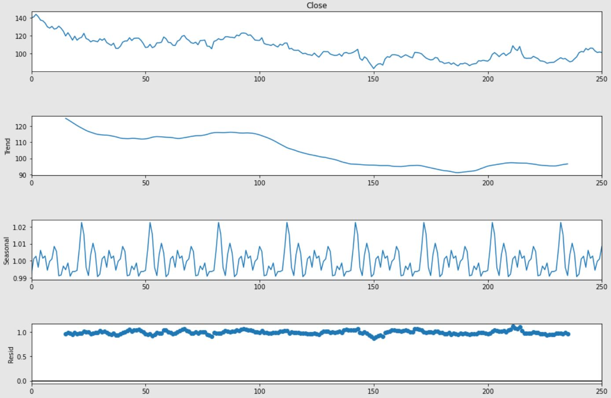

## Dickey- Fuller test to check for stationarity

This is the most commonly used statistical test for checking stationarity.
We consider,

Null hypothesis (H0): The series is non-stationary
Alternative hypothesis (H1): The series is stationary

The test will return a test static and critical value for different confidence levels. We reject the null hypothesis if the test statistic is less than the critical value, in which case we accept the alternative i.e, the series is stationary.

We perform the test on close value. 
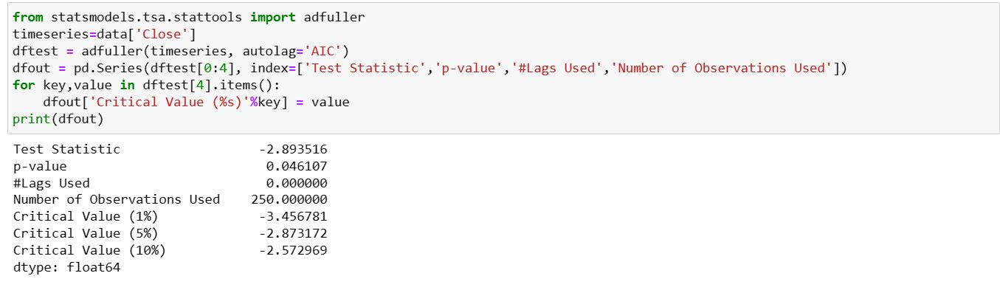

The p-value is less than the critical value (0.05). Therefore we reject the null hypothesis, i.e, the series is stationary.

## ARIMA
An autoregressive integrated moving average, or ARIMA, is a statistical analysis model that uses time series data to either better understand the data set or to predict future trends. 
ARIMA makes use of lagged moving averages to smooth time series data.
There are 3 main components to an ARIMA model.

Autoregression (AR)- refers to a model that shows a changing variable that regresses on its own lagged, or prior, values. I.e, the past values have an effect on future values.

Integrated (I):  represents the differencing of raw observations to allow the time series to become stationary (i.e., data values are replaced by the difference between the data values and the previous values)

Moving Average (MA): incorporates the dependency between an observation and a residual error from a moving average model applied to lagged observations. By calculating the moving average, the impacts of random, short-term fluctuations on the price of a stock over a specified time frame are mitigated.

## ARIMA Parameters
For ARIMA models, a standard notation would be ARIMA with p, d, and q, where integer values substitute for the parameters to indicate the type of ARIMA model used. The parameters can be defined as:

p: the number of lag observations in the model, also known as the lag order. (number of autoregressive terms)
d: the number of times the raw observations are differenced; also known as the degree of differencing. (number of nonseasonal differences)
q: the size of the moving average window, also known as the order of the moving average. (Number of lagged forecast errors in the prediction equation)
The order of regression (p) and order of moving average (q) are determined by comparing autocorrelations and partial autocorrelations.

### Calculating p,d and q

#### d value
We use differencing to find the value of d.

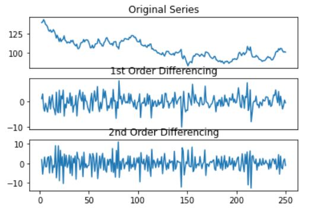

In first-order differencing we have fewer noises in the data while after 1st order there is an increase in the noise. So we can select 1st order differencing for our model. We can also verify this using an autocorrelation plot. 

#### p value

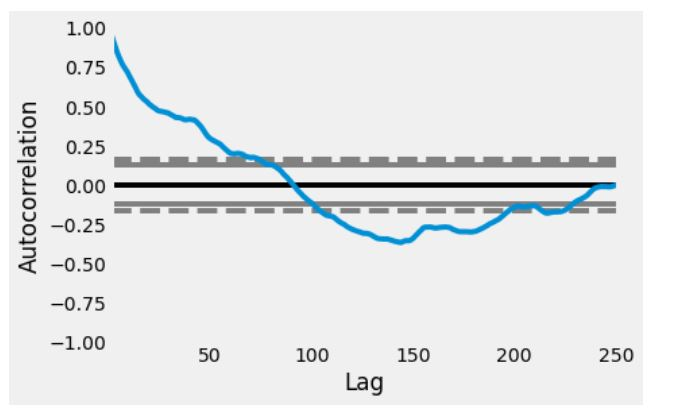

In the above autocorrelation plot, the curve is moving down after the 7th line of the first boundary. That is how to decide the p-value. Hence the value of p is 7.

#### q value

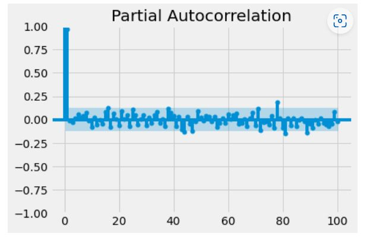

In the above partial autocorrelation plot, we can see that only two points are far away from all the points. That is how to decide the q value. Hence the value of q is 2.

### Training the model

#### Using ARIMA model
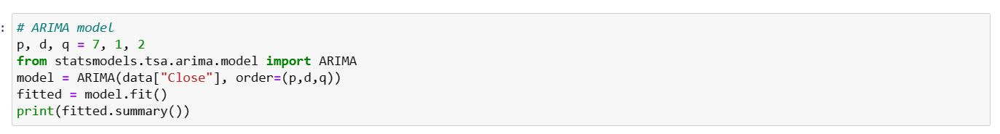

ARIMA will not work well with seasonal data, so we use SARIMA model.

#### Using SARIMA model
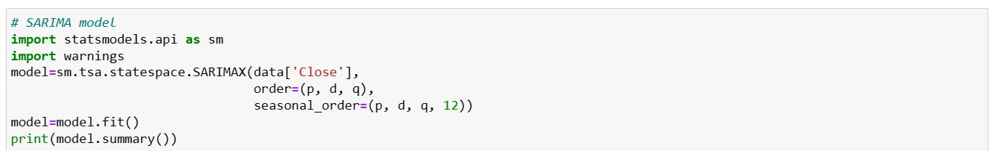

#### Prediction

After training the model, we predict the stock value for the next 10 days.

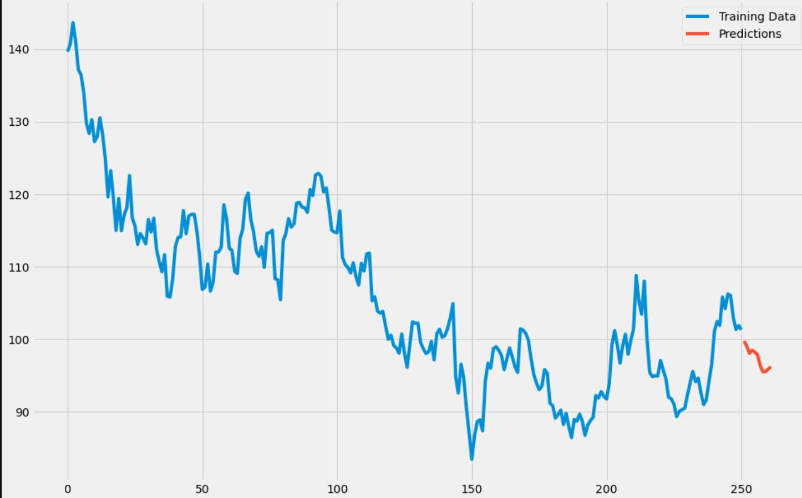

### Spliting the data into train and test.

The data is split into train and test set for the purpose of training the model and testing the model. We keep the last 30 days of data for testing and the remianing data for training.

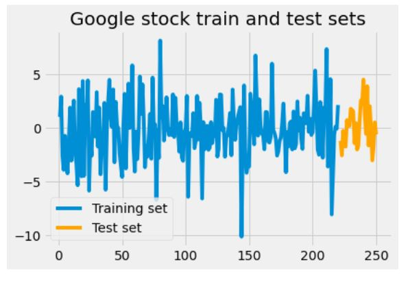

The train set is then used to train the SARIMA model and the test set is then used to make the predictions.
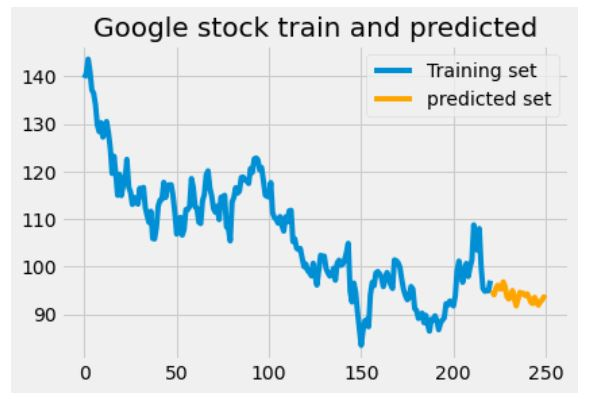

### Evaluating the model.

We use RMSE and MAPE as our evaluation matrix.

RMSE measures the average magnitude of the errors in a set of predictions, i.e., it calculates the square root of the average of squared differences between the predicted and actual values. The lower the value of RMSE, the better the model's performance.

MAPE, on the other hand, measures the percentage difference between the predicted and actual values. It is calculated as the average absolute percentage difference between the predicted and actual values, expressed as a percentage of the actual value. The lower the value of MAPE, the better the model's performance.

RMSE is sensitive to outliers and large errors, while MAPE is not. MAPE, however, can be problematic when the actual values are close to zero, as it can lead to division by zero or very large values.

The model has an RMSE of 6.857 and MAPE of 0.0541.

### References:
1. https://analyticsindiamag.com/quick-way-to-find-p-d-and-q-values-for-arima/
2. https://thecleverprogrammer.com/2022/06/21/time-series-forecasting-with-arima/

